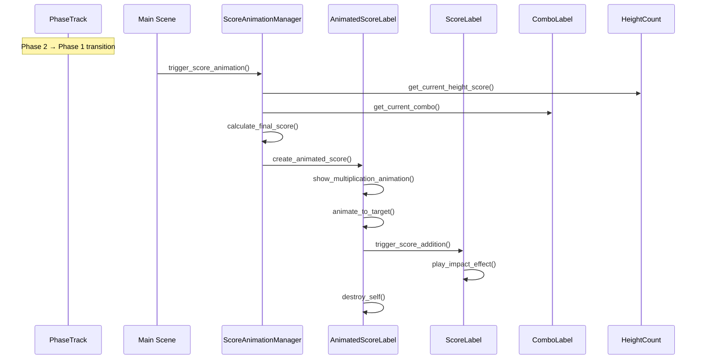

# Design Document

## Overview

The score popup animation system will enhance the existing phase transition mechanism by adding visual feedback when the player transitions from phase 2 (jumping/height phase) back to phase 1 (ground phase). The system will capture the height score from the phase 2 display, combine it with the current combo multiplier, and animate the calculated result moving to the main score display in the top right corner.

The design leverages the existing phase management system (`PhaseTrack`), UI elements (`ScoreLabel`, `ComboLabel`, `HeightCount`), and integrates seamlessly with the current game flow without disrupting critical gameplay mechanics.

## Architecture

### Core Components

1. **ScoreAnimationManager** - New singleton autoload that orchestrates the animation sequence
2. **AnimatedScoreLabel** - New scene/script for the flying score display
3. **Enhanced ScoreLabel** - Modified to handle animated score additions with visual feedback
4. **Phase Transition Hook** - Integration point in the existing phase transition logic

### System Flow



## Components and Interfaces

### ScoreAnimationManager (Singleton)

**Purpose**: Central coordinator for all score animation logic

**Key Methods**:
- `trigger_score_animation(height_score: int, combo: int, start_position: Vector2, target_position: Vector2)`
- `get_combo_multiplier() -> int`
- `get_height_score() -> int`
- `calculate_final_score(height: int, combo: int) -> int`

**Properties**:
- `animation_enabled: bool = true`
- `multiplication_duration: float = 0.75`
- `movement_duration: float = 1.2`
- `impact_duration: float = 0.3`

### AnimatedScoreLabel (Scene)

**Purpose**: Visual representation of the flying score with multiplication animation

**Structure**:
```
AnimatedScoreLabel (Control)
├── ScoreContainer (Control)
│   ├── HeightScoreLabel (Label)
│   ├── MultiplicationLabel (Label) # "×"
│   ├── ComboLabel (Label)
│   ├── EqualsLabel (Label) # "="
│   └── FinalScoreLabel (Label)
├── AnimationPlayer (AnimationPlayer)
└── Tween (Tween)
```

**Key Methods**:
- `initialize(height_score: int, combo: int, start_pos: Vector2, target_pos: Vector2)`
- `play_multiplication_animation()`
- `animate_to_target()`
- `trigger_impact_effect()`

**Animation Phases**:
1. **Multiplication Phase**: Show height × combo = result with staggered appearance
2. **Movement Phase**: Smooth curve animation to target position
3. **Impact Phase**: Scale/fade effect on contact with main score display

### Enhanced ScoreLabel

**Purpose**: Existing score display enhanced with impact feedback

**New Methods**:
- `add_animated_score(amount: int)`
- `play_impact_effect()`
- `update_score_with_jitter(new_score: int)`

**Visual Effects**:
- Scale bounce on score addition
- Color flash effect
- Subtle shake/jitter animation

### Integration Points

**Main Scene Modifications**:
- Hook into existing phase transition logic in `_on_player_height()`
- Capture score position from `HeightCount` when transitioning
- Trigger animation before hiding phase 2 UI elements

**HeightCount Integration**:
- Add method to get current displayed score value
- Provide screen position for animation start point

## Data Models

### ScoreAnimationData

```gdscript
class_name ScoreAnimationData
extends Resource

@export var height_score: int
@export var combo_multiplier: int
@export var final_score: int
@export var start_position: Vector2
@export var target_position: Vector2
@export var animation_id: String
```

### AnimationSettings

```gdscript
class_name AnimationSettings
extends Resource

@export var multiplication_duration: float = 0.75
@export var movement_duration: float = 1.2
@export var impact_duration: float = 0.3
@export var curve_height: float = 100.0
@export var enable_multiplication_animation: bool = true
@export var enable_impact_effects: bool = true
```

## Error Handling

### Fallback Mechanisms

1. **Animation Failure**: If animation system fails, fall back to immediate score update
2. **Missing UI Elements**: Graceful degradation if target UI elements are not found
3. **Performance Issues**: Skip animations if frame rate drops below threshold
4. **Multiple Animations**: Queue system to handle rapid phase transitions

### Error Recovery

```gdscript
func safe_animate_score(data: ScoreAnimationData) -> bool:
    if not is_animation_safe():
        fallback_to_immediate_update(data)
        return false
    
    try:
        return perform_animation(data)
    except:
        fallback_to_immediate_update(data)
        return false
```

## Testing Strategy

### Unit Tests

1. **ScoreAnimationManager**:
   - Score calculation accuracy
   - Animation timing validation
   - Fallback mechanism triggers

2. **AnimatedScoreLabel**:
   - Proper initialization with different score values
   - Animation completion callbacks
   - Memory cleanup after animation

3. **Enhanced ScoreLabel**:
   - Impact effect timing
   - Score update accuracy
   - Visual effect completion

### Integration Tests

1. **Phase Transition Integration**:
   - Animation triggers at correct phase transition
   - UI element visibility states during animation
   - No interference with player controls

2. **Performance Tests**:
   - Animation performance under various score values
   - Memory usage during multiple animations
   - Frame rate impact measurement

3. **Edge Case Testing**:
   - Zero combo multiplier handling
   - Very large score values
   - Rapid phase transitions
   - Animation interruption scenarios

### Visual Testing

1. **Animation Smoothness**: Verify smooth curves and timing
2. **UI Positioning**: Ensure animations don't obstruct critical gameplay areas
3. **Visual Feedback**: Confirm impact effects provide satisfying feedback
4. **Accessibility**: Test with different screen sizes and UI scales

## Performance Considerations

### Optimization Strategies

1. **Object Pooling**: Reuse AnimatedScoreLabel instances to reduce garbage collection
2. **Conditional Rendering**: Skip complex effects on lower-end devices
3. **Animation Culling**: Don't animate scores outside visible screen area
4. **Tween Optimization**: Use hardware-accelerated tweening where possible

### Resource Management

- Automatic cleanup of animation objects after completion
- Texture atlas for score display elements
- Minimal shader usage for impact effects
- Efficient curve calculation for movement paths

## Implementation Notes

### Existing Code Integration

The design carefully integrates with existing systems:

- **PhaseTrack**: Uses existing phase management without modification
- **Main Scene**: Minimal changes to `_on_player_height()` method
- **UI Elements**: Extends existing functionality rather than replacing
- **Score System**: Maintains compatibility with current scoring logic

### Animation Timing Coordination

All animations are designed to complete before the player reaches the ground, ensuring no interference with critical landing gameplay. The total animation duration (≤3 seconds) accounts for typical fall time from peak height.

### Accessibility Features

- Option to disable animations for motion-sensitive players
- High contrast mode for score display elements
- Configurable animation speed settings
- Audio cues for score addition (optional)